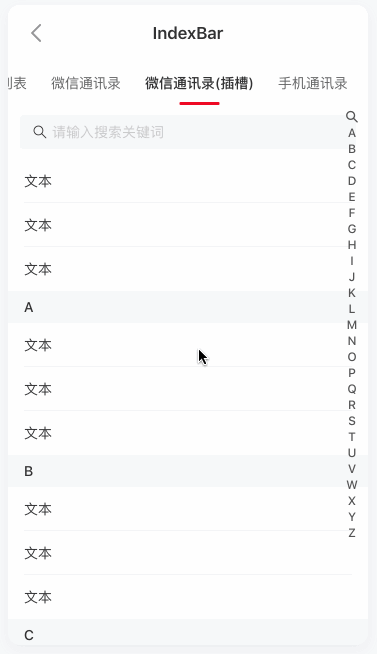

# IndexBar 索引栏

本篇笔者来讲解一下 `index-bar` 和 `index-anchor` 的实现原理和细节处理，以及结合实际场景会对其进行拓展，来实现`Wechat`通讯录相似的功能，保证让`index-bar`变得更加生动有趣，满足更多的业务场景。当然笔者会结合自身的理解，已经为每个核心的方法增加了必要的注释，会尽最大努力将其中的原理讲清楚，若有不妥之处，还望不吝赐教，欢迎批评指正。

## 预览




## 层级结构

`index-bar` ：主要由 `内容` 和 `van-index-bar__sidebar`组成，`van-index-bar__sidebar` 主要就是用来 `点击或者触摸滑动` 来滚动到指定的锚点(`index-anchor`).

`index-anchor` ：主要由一个 `div` 包裹着一个 `van-index-anchor`，其中 `van-index-anchor` 如果 `吸顶` 了会变成 `fixed` 定位，以及包裹他的父元素( `div` )会设置高度，用于弥补其脱离文档流后的高度。

## 实现原理

笔者觉得 `index-bar` 中最核心的地方，在于滚动过程中，锚点的吸顶的处理。其中主要包括：获取哪个活跃的锚点将要吸顶，以及上一个活跃的锚点如何退场等。所以我们把核心点关注在：`index-bar` 所处的滚动容器 `scroller` 的滚动事件上。

```js
mixins: [
  TouchMixin,
  ParentMixin('vanIndexBar'),
  BindEventMixin(function (bind) {
    // bind: on/off 函数
    if (!this.scroller) {
      this.scroller = getScroller(this.$el);
    }
    bind(this.scroller, 'scroll', this.onScroll);
  }),
],

onScroll() {
  if (isHidden(this.$el)) {
    return;
  }
  // 获取滚动容器的scrollTop
  const scrollTop = getScrollTop(this.scroller);
  // 返回滚动容器元素的大小及其相对于视口的位置 因为滚动容器可能不是 window/body，而且也有可能距离视口顶部有一段距离
  const scrollerRect = this.getScrollerRect();
  // 计算每一个锚点在滚动容器中的具体位置 top/height
  const rects = this.children.map((item) =>
    item.getRect(this.scroller, scrollerRect)
  );
  // 获取当前活跃的锚点
  const active = this.getActiveAnchorIndex(scrollTop, rects);

  this.activeAnchorIndex = this.indexList[active];

  if (this.sticky) {
    this.children.forEach((item, index) => {
      // 由于要设置 active 和 active-1 锚点的 fixed 属性，所以要把其，父容器的宽高 继承过来
      if (index === active || index === active - 1) {
        const rect = item.$el.getBoundingClientRect();
        item.left = rect.left;
        item.width = rect.width;
      } else {
        item.left = null;
        item.width = null;
      }

      // 核心代码
      if (index === active) {
        // 这里锚点已经是 fixed 定位
        item.active = true;
        
        // 计算top: 由于锚点 fixed 定位的 top为0,这里设置的top 是用于设置自身锚点的transform.y
        // rects[index].top 是相对于滚动容器的位置，是固定值
        // scrollTop: 是变量，向上滚动 增大， 向下滚动 减小
        item.top =
          Math.max(this.stickyOffsetTop, rects[index].top - scrollTop) +
          scrollerRect.top;
      } else if (index === active - 1) {
        // 由于涉及到上一个活跃锚点 会被新的活跃锚点 随着滚动而顶掉
        const activeItemTop = rects[active].top - scrollTop;
        // 是否活跃：当活跃的锚点的顶部正好和滚动容器的顶部重合
        item.active = activeItemTop > 0;
        // 设置其top
        item.top = activeItemTop + scrollerRect.top - rects[index].height;
      } else {
        item.active = false;
      }
    });
  }
},
// 获取有效的锚点索引
getActiveAnchorIndex(scrollTop, rects) {
  // 细节：从后往前遍历 找到第一个满足条件的锚点退出即可
  for (let i = this.children.length - 1; i >= 0; i--) {
    // 取出上一个活跃（吸顶）锚点的高度
    const prevHeight = i > 0 ? rects[i - 1].height : 0;
    const reachTop = this.sticky ? prevHeight + this.stickyOffsetTop : 0;
    // 判断某个锚点第一次进入临界值 这里计算的都是相对 滚动容器 来计算的 所以是统一坐标系
    if (scrollTop + reachTop >= rects[i].top) {
      return i;
    }
  }
  return -1;
},
```

## Web Api

笔者在看源码的时候，发下了比较好用的API，很好的减轻了许多复杂逻辑处理，特此分享一下，希望大家多去 [MDN Web Docs](https://developer.mozilla.org/zh-CN/) 翻翻好用的API。笔者列出的API，会的你就当做复习，不会的API，你就权当学习啦。

- [getBoundingClientRect](https://developer.mozilla.org/zh-CN/docs/Web/API/Element/getBoundingClientRect)
- [elementFromPoint](https://developer.mozilla.org/zh-CN/docs/Web/API/Document/elementFromPoint)
- [dataset](https://developer.mozilla.org/en-US/docs/Web/API/HTMLElement/dataset)
- [scrollIntoView](https://developer.mozilla.org/zh-CN/docs/Web/API/Element/scrollIntoView)

## 拓展

美中不足的是 `Vant` 大大提供的 `index-bar` 和 `index-anchor` 只能满足一些基本所需，一些定制化的需求，比如`微信通讯录`、`手机通讯录`等样式，还不能提供友好的支撑，笔者这里站在巨人的肩膀上，手把手教大家实现`Wechat`通讯录相似的功能。以及为`index-bar`增加更多的特性和拓展性。

而且，本次涉及的拓展，只是`UI`层面的东西，不会更改`vant`提供的核心原理(`onScoll`)的内容，所以，咋们只关注UI相关的东西即可。Let's get it...

### 微信通讯录

### 特性

- 微信通讯录的`index-bar`增加了点击或者触摸`tag`，会在`tag`左侧弹出一个`hint`，且松手后，会回到`index-bar`最大能吸顶的`tag`和`anchor`。
- 可以设置`tag`触摸或点击，不弹出`hint`，比如搜索`🔍``tag`。
- `tag`以及`hint`能支持用户自定义，即提供插槽。

### 实现

**针对特性一**，我们需要监听用户的`touchstart`、`touchmove`、`touchend`、`touchcancel`触摸事件，并且要知道当前是`触摸index-bar`的状态，还是`滚动内容`的状态，因为涉及到哪个`index-bar`上哪个`tag`高亮。具体代码如下：

```js
// 开始触摸
onTouchStart(event) {
  // 正在触摸
  this.isTouching = true
  // 调用touch start方法
  this.touchStart(event)

  // 处理事件
  this.handleTouchEvent(event)
},

// 正在触摸
onTouchMove(event) {
  this.touchMove(event);

  if (this.direction === 'vertical') {
    // 阻止默认事件
    preventDefault(event);

    // 处理touch事件
    this.handleTouchEvent(event)
  }
},

// 结束或取消touch
onTouchEnd() {
  this.active = null;

  // 结束触摸
  this.isTouching = false
},


// 触摸事件处理
handleTouchEvent(event){
  const { clientX, clientY } = event.touches[0];
  // https://developer.mozilla.org/zh-CN/docs/Web/API/Document/elementFromPoint
  // 获取点击的元素
  const target = document.elementFromPoint(clientX, clientY);
  if (target) {
    // https://developer.mozilla.org/en-US/docs/Web/API/HTMLElement/dataset
    // const { index } = target.dataset;
    const index = this.findDatasetIndex(target)

    /* istanbul ignore else */
    if (index && this.touchActiveIndex !== index) {
      
      this.touchActiveIndex = index;

      // 记录手指触摸下的索引
      this.touchActiveAnchorIndex = index

      this.scrollToElement(target);
    }
  }
},
// 渲染索引
renderIndexes(){
  return this.indexList.map((index) => {
    
    // const active = index === this.activeAnchorIndex;
    // 这里区分一下 按下和松手 这两个状态的 活跃索引 
    const active = this.isTouching ? (index === this.touchActiveAnchorIndex) : (index === this.activeAnchorIndex);
    const ignore = this.ignoreTags.some((value) => {
      return value === index
    })

    return (
      <span
        class={bem('index', { active })}
        style={active ? this.highlightStyle : null}
        data-index={index}
      >
        {this.renderIndexTag(index, active, ignore)}
        {this.renderIndexHint(index, active, ignore)}
      </span>
    );
  });
},
```

这里涉及到 `isTouching` 的设置，以及`touchActiveAnchorIndex`的记录，这里会后面渲染索引列表中哪个`tag`高亮做准备。

```js
// 这里区分一下 按下和松手 这两个状态的 活跃索引 
const active = this.isTouching ? (index === this.touchActiveAnchorIndex) : (index === this.activeAnchorIndex);
```

在`tag`左侧弹出一个`hint`，利用`子绝父相`布局，这个功能比较好实现。即：一个父元素`tag`，就会对应一个子元素`hint`。然后哪个`tag`是`active`并且`isTouching = true`时，其子元素`hint`就会弹出。

**针对特性二**，点击某个`tag`，不弹出`hint`，这个功能也比较简单，在`index-bar`的`props`新增一个属性，类型为`string[] | number[]`，`ignoreTags`：忽略的`Tags`，这些忽略`Tag`, 不会高亮显示，点击或长按 不会弹出 `tagHint`。

```js
// 这里区分一下 按下和松手 这两个状态的 活跃索引 
const active = this.isTouching ? (index === this.touchActiveAnchorIndex) : (index === this.activeAnchorIndex);

// 去ignoreTags中查找，这个tag是否被忽略
const ignore = this.ignoreTags.some((value) => {
  return value === index
})
```

**针对特性三**，我们只需要为`tag`和`hint`提供一个[具名插槽](https://cn.vuejs.org/v2/guide/components-slots.html#%E4%BD%9C%E7%94%A8%E5%9F%9F%E6%8F%92%E6%A7%BD)，并且抛出一个带`index`，`active`，`ignore`三个参数的对象即可。这样就可以满足用户的自定义了。具体代码如下

```js
// 渲染索引tag
renderIndexTag(index, active, ignore) {
  // 有插槽
  const slot = this.slots('tag', { index, active, ignore });
  if (slot) {
    return slot
  }

  // 默认状态下的样式
  const style = {}
  // 活跃状态且不忽略的场景下
  if (active&&!ignore) {
    if (this.highlightColor) {
      style.color = this.highlightColor;
    }
    if (this.highlightBackgroundColor) {
      style.backgroundColor = this.highlightBackgroundColor;
    }
  }
  return <span style={style} data-index={index}>{index}</span>
},

// 渲染索引Hint
renderIndexLeftHint(index, active, ignore) {
  // 显示hint的场景
  const show = active && this.isTouching && !ignore
  // 获取插槽内容
  const slot = this.slots('hint', { index, active, ignore });
  
  if (slot) {
    return show ? slot : ''
  }

  // 默认场景
  return (
    <div vShow={show} class={bem('hint','pop')}>
      <span>{index}</span>
    </div>
  )
}
```

如果用户使用`tag`插槽的场景下，这里有个比较细节的地方，对于`renderIndexTag`，默认不使用插槽时，其内容如下：`<span style={style} data-index={index}>{index}</span>` 这里我们可以看到这里有个`data-index={index}`，因为`tag`点击事件或者`sidbar`触摸事件，获取对应的索引都是通过`const { index } = element.dataset;`去获取索引的，但是如果用户自定义`tag`时，用户不会知道还要传个`data-index={index}`，导致传统的方法`const { index } = element.dataset;`获取的`index`为空。导致点击无效。

解决办法就是在`tag`的父元素身上也添加一个`data-index={index}`，如果用户在自定义`tag`传了`data-index={index}`，则使用用户传的`index`；反之，则使用其父元素提供的`index`。具体方法如下：

```js
// 查询dataset index
findDatasetIndex(target) {
  if (target) {
    const { index } = target.dataset;
    if (index) {
      return index
    }
    return this.findDatasetIndex(target.parentElement)
  }
  return undefined
},
```

### 手机通讯录

`手机通讯录`跟`微信通信录`，可谓是如出一辙，唯一不同的就是，`tagHint`弹出的位置不同罢了，前者居中弹出，而后者是`tag`左侧弹出。大家可能第一时间想到的就是依葫芦画瓢，把`微信通讯录`的`hint`的`position: absolute;`改成`position: fixed;`不就可以了么？`理想很丰满，现实很骨感` 我只能这么说！

由于`van-index-bar__sidebar`的`css`设置了`transform: translateY(-50%);`导致其子元素设置的`position: fixed;`都会失效。所以我们采用的是将`hint`放在`van-index-bar`中去即可。关键代码如下：

```js
// 渲染索引中间Hint
renderIndexCenterHint() {

  if (this.hintType !== 'center') {
    return null
  }

  const index = this.touchActiveAnchorIndex
  const active = index !== null
  const ignore = this.ignoreTags.some((value) => {
    return value === index
  })

  // 显示hint的场景
  const show = active && this.isTouching && !ignore
  // 获取插槽内容
  const slot = this.slots('hint', { index, active, ignore });
  
  if (slot) {
    return show ? slot : ''
  }

  // 默认场景
  return (
    <div vShow={show} class={bem('hint','pop-center')}>
      <span>{index}</span>
    </div>
  )
}
// UI层
render() {
  const Indexes = this.renderIndexes()
  const centerHint = this.renderIndexCenterHint()
  return (
    <div class={bem()}>
      <div
        class={bem('sidebar')}
        style={this.sidebarStyle}
        onClick={this.onClick}
        onTouchstart={this.onTouchStart}
        onTouchmove={this.onTouchMove}
        onTouchend={this.onTouchEnd}
        onTouchcancel={this.onTouchEnd}
      >
        {Indexes}
      </div>
      {this.slots('default')}
      {centerHint}
    </div>
  );
}
```

