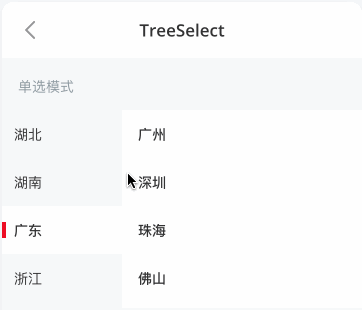
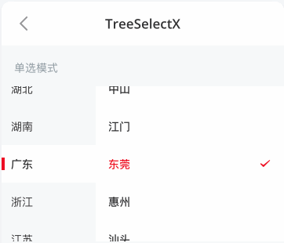

# TreeSelect 分类选择

本篇笔者来讲解一下 `tree-select` 的实现原理和细节处理，结合实际场景会对其进行拓展，以及优化用户体验问题，以便满足更多的业务场景。当然笔者会结合自身的理解，已经为每个核心的方法增加了必要的注释，会尽最大努力将其中的原理讲清楚，若有不妥之处，还望不吝赐教，欢迎批评指正。

## 预览

|`优化前`|`优化后`|
|:-------------:|:-------------:|
|||


## 原理

`tree-select`的层级主要由 [侧边导航栏](https://vant-ui.github.io/vant/v2/#/zh-CN/sidebar) 和 `内容页(Content)` 组成，层级结构也非常清晰明了，业务逻辑也比较简单，主要用到技术可能就是`双向绑定`，比如：`main-active-index` 表示左侧高亮选项的索引，`active-id` 表示右侧高亮选项的 id。

```js
emit(ctx, 'update:main-active-index', index);
emit(ctx, 'update:active-id', newActiveId);
```

## 拓展

`tree-select`在我们项目中使用的还算高频，尽管组件易用，原理简单的同时，也存在些许美中不足，其主要还是用户体验的问题，本次`tree-select`拓展就是优化用户体验。项目中用户反馈最多的两个问题如下：

- 左侧导航栏和右侧内容能滚动时，点击左侧选项和点击右侧选项时，能滚动到 `tree-select` 的中间位置。
- 由于移动端大多数都是`keep-alive`模式，当`tree-select`可视时，左侧高亮选项和右侧选项也得可视。

上面看似两个问题，实则是一个问题，只要我们在用户点击左侧选项和点击右侧选项，以及在`activated`方法中，将此选项滚动到中间位置即可。具体实现如下，大家看看代码就会一目了然。

```js

export default createComponent({
  props: {
    max: {
      type: [Number, String],
      default: Infinity,
    },
    items: {
      type: Array,
      default: () => [],
    },
    height: {
      type: [Number, String],
      default: 300,
    },
    activeId: {
      type: [Number, String, Array],
      default: 0,
    },
    selectedIcon: {
      type: String,
      default: 'success',
    },
    mainActiveIndex: {
      type: [Number, String],
      default: 0,
    },
  },

  data() {
    return {

    }
  },

  computed: {
    isMultiple(){
      return Array.isArray(this.activeId);
    }
  },

  watch: {
    // 也需要监听左侧导航栏索引的变化，但是滚动时不加动画，因为此值有可能是异步设置的
    mainActiveIndex(val) {
      // 这种场景直接滚动
      this.scrollIntoNavView(+val, true)
    },

    // 也需要监听右侧内容栏索引的的变化，但是滚动时不加动画，因为此值有可能是异步设置的
    activeId() {
      // 这种场景直接滚动
      this.scrollIntoContentView(this.getCurrentContentIndex(+this.mainActiveIndex), true)
    },

    // 数据源变化了 设置一下
    items(){
      this.init()
    }
  },

  async mounted() {
    await this.$nextTick()
    // 获取滚动器
    const { navScroller, scroller } = this.$refs
    this.navScroller = navScroller.$el
    this.scroller = scroller

    // 滚动指定的nav和content索引
    this.scrollToView(true)
  },

  activated() {
    this.scrollToView(true)
  },

  methods: {

    async init() {
      // 这里要置空
      this.lastScrollActiveId = null

      await this.$nextTick()

      // 滚动指定的nav和content索引
      this.scrollToView(true)
    },

    isActiveItem(id) {
      return this.isMultiple
        ? this.activeId.indexOf(id) !== -1
        : this.activeId === id;
    },


    renderContent() {
      if (this.slots.content) {
        return this.slots.content();
      }

      const selectedItem = this.items[+this.mainActiveIndex] || {};
      const subItems = selectedItem.children || [];

      return subItems.map((item, index) => (
        <div
          key={item.id}
          class={[
            'van-ellipsis',
            bem('item', {
              active: this.isActiveItem(item.id),
              disabled: item.disabled,
            }),
          ]}
          onClick={() => {
            if (!item.disabled) {
              let newActiveId = item.id;
              if (this.isMultiple) {
                newActiveId = (this.activeId).slice();

                const index = newActiveId.indexOf(item.id);

                if (index !== -1) {
                  newActiveId.splice(index, 1);
                } else if (newActiveId.length < this.max) {
                  newActiveId.push(item.id);
                }
              }

              this.$emit('update:active-id', newActiveId);
              this.$emit('click-item', item);
              // compatible with legacy usage, should be removed in next major version
              this.$emit('itemclick', item);

              // 滚动到指定的index
              this.scrollIntoContentView(index)

              // 由于content可以支持多选，所以要记录最后一次滚动的item
              this.lastScrollActiveId = item.id
            }
          }}
        >
          {item.text}
          {this.isActiveItem(item.id) && (
            <Icon name={this.selectedIcon} class={bem('selected')} />
          )}
        </div>
      ));
    },

    // 获取当前content索引
    getCurrentContentIndex(mainActiveIndex) {
      let index = 0
      const activeId = this.isMultiple ? this.lastScrollActiveId : this.activeId
      const selectedItem = this.items[mainActiveIndex] || {};
      const subItems = selectedItem.children || [];
      for (let i = 0; i < subItems.length; i++) {
        const { id } = subItems[i];
        if (activeId === id) {
          index = i
          break
        }
      }
      return index
    },

    // 滚动到指定的 nav 和 content
    scrollToView(immediate) {
      this.navScroller && this.scrollIntoNavView(+this.mainActiveIndex, immediate)
      this.scroller && this.scrollIntoContentView(this.getCurrentContentIndex(+this.mainActiveIndex), immediate)
    },

    // 滚动到某个nav 居中
    scrollIntoNavView(index, immediate) {
      const {navScroller} = this;

      // 容错
      if (!navScroller) {
        return;
      }

      // 获取当前nav index
      const mIdx = index;
      if (mIdx < 0) {
        return;
      }

      // 获取
      const nav = navScroller.children[mIdx];
      if (!nav) {
        return;
      }

      // 如果还在动画中 直接过掉
      if (this.navAnimating) {
        return
      }

      // 动画开始
      this.navAnimating = true
      // 滚动到指定位置
      const to =
        nav.offsetTop - (navScroller.offsetHeight - nav.offsetHeight) / 2;
      scrollTopTo(navScroller, to, immediate ? 0 : 0.3, () => {
        // 动画结束
        this.navAnimating = false
      });
    },

    // 滚动到指定view
    scrollIntoContentView(index, immediate) {
      const {scroller} = this;

      // 容错
      if (!scroller) {
        return;
      }

      // index
      if (index < 0) {
        return;
      }

      // 获取
      const content = scroller.children[index];
      if (!content) {
        return;
      }

      // 如果还在动画中 直接过掉
      if (this.contentAnimating) {
        return
      }

      // 动画开始
      this.contentAnimating = true;

      // 滚动到指定位置
      const to =
        content.offsetTop - (scroller.offsetHeight - content.offsetHeight) / 2;
      scrollTopTo(scroller, to, immediate ? 0 : 0.3, () => {
        this.contentAnimating = false;
      });
    },
  },

  render() {

    if (process.env.NODE_ENV === 'development') {
      if (this.$listeners.navclick) {
        console.warn(
          '[Vant] TreeSelect: "navclick" event is deprecated, use "click-nav" instead.'
        );
      }
      if (this.$listeners.itemclick) {
        console.warn(
          '[Vant] TreeSelect: "itemclick" event is deprecated, use "click-item" instead.'
        );
      }
    }

    const Navs = this.items.map((item) => (
      <SidebarItem
        dot={item.dot}
        info={item.badge ?? item.info}
        title={item.text}
        disabled={item.disabled}
        class={[bem('nav-item'), item.className]}
      />
    ));

    return (
      <div class={bem()} style={{ height: addUnit(this.height) }}>
        <Sidebar
          ref="navScroller"
          class={bem('nav')}
          activeKey={this.mainActiveIndex}
          onChange={(index) => {
            this.$emit('update:main-active-index', index);
            this.$emit('click-nav', index);
            // compatible with legacy usage, should be removed in next major version
            this.$emit('navclick', index);

            // 滚动到指定位置
            this.scrollIntoNavView(index);

            // 滚动到指定的contentView
            this.scrollIntoContentView(this.getCurrentContentIndex(index), true);
          }}
        >
          {Navs}
        </Sidebar>
        <div ref="scroller" class={bem('content')}>{this.renderContent()}</div>
      </div>
    );
  }
});


// API
import { scrollTopTo } from '../tabs/utils';

export function scrollTopTo(
  scroller: HTMLElement,
  to: number,
  duration: number,
  callback: Function
) {
  let current = getScrollTop(scroller);

  const isDown = current < to;
  const frames = duration === 0 ? 1 : Math.round((duration * 1000) / 16);
  const step = (to - current) / frames;

  function animate() {
    current += step;

    if ((isDown && current > to) || (!isDown && current < to)) {
      current = to;
    }

    setScrollTop(scroller, current);

    if ((isDown && current < to) || (!isDown && current > to)) {
      raf(animate);
    } else if (callback) {
      raf(callback as FrameRequestCallback);
    }
  }

  animate();
}

```

## Q&A

Q：`Vant`尚未支持以上滚动特性，前端该如何处理？

A：笔者拿`vant`提供的`Demo`来实现以上特性。其实无非就是把上面的逻辑处理拎出来即可，关键代码如下详见👉 `src/tree-select/demo/index.vue` 。

```js

  <tree-select
    height="55vw"
    ref="treeSelect"
    :items="items"
    :active-id.sync="activeId"
    :main-active-index.sync="activeIndex"
    @click-item="onClickItem"
    @click-nav="onClickNav"
  />

  async mounted() {
    // 获取
    await this.$nextTick();

    const { children } = this.$refs.treeSelect;
    const [navScroller, scroller] = children;

    this.navScroller = navScroller;
    this.scroller = scroller;

    // 滚动指定的nav和content索引
    this.scrollToView(true)
  },

  activated() {
    // 滚动指定的nav和content索引
    this.scrollToView(true)
  },

  methods: {

    // 点击左侧导航时触发 或者 mainActiveIndex 切换也会调用
    async onClickNav(index) {

      // 0 获取 item
      // 3、navScroller一直滚动到中间位置
      this.scrollIntoNavView(index, false);

      // 4、重置content的滚动条
      // 滚动到指定的contentView
      this.scrollIntoContentView(this.getCurrentContentIndex(index), true);
    },

    // 点击右侧选择项时触发
    async onClickItem(item) {
      const { id } = item;
      let index = -1
      const { children } = this.items[+this.activeIndex]
      for (let i = 0; i < children.length; i++) {
        const c = children[i];
        if (c.id === id) {
          index = i
          break
        }
      }

      // content 要滚动到中间
      this.scrollIntoContentView(index);

      // 由于content可以支持多选，所以要记录最后一次滚动的item
      this.lastScrollActiveId = item.id
    },


    // 获取当前content索引
    getCurrentContentIndex(mainActiveIndex) {
      let index = 0
      const activeId = this.isMultiple ? this.lastScrollActiveId : this.activeId
      const selectedItem = this.items[mainActiveIndex] || {};
      const subItems = selectedItem.children || [];
      for (let i = 0; i < subItems.length; i++) {
        const { id } = subItems[i];
        if (activeId === id) {
          index = i
          break
        }
      }
      return index
    },

    // 滚动到指定的 nav 和 content
    scrollToView(immediate) {
      this.navScroller && this.scrollIntoNavView(+this.activeIndex, immediate)
      this.scroller && this.scrollIntoContentView(this.getCurrentContentIndex(+this.activeIndex), immediate)
    },

    // 滚动到某个nav 居中
    scrollIntoNavView(index, immediate) {
      const {navScroller} = this;

      // 容错
      if (!navScroller) {
        return;
      }

      // 获取当前nav index
      const mIdx = index;
      if (mIdx < 0) {
        return;
      }

      // 获取
      const nav = navScroller.children[mIdx];
      if (!nav) {
        return;
      }

      // 滚动到指定位置
      const to =
        nav.offsetTop - (navScroller.offsetHeight - nav.offsetHeight) / 2;
      scrollTopTo(navScroller, to, immediate ? 0 : 0.3);
    },

    // 滚动到指定view
    scrollIntoContentView(index, immediate) {
      const {scroller} = this;

      // 容错
      if (!scroller) {
        return;
      }

      // 获取当前nav index
      if (index < 0) {
        return;
      }

      // 获取
      const content = scroller.children[index];
      if (!content) {
        return;
      }

      // 滚动到指定位置
      const to =
        content.offsetTop - (scroller.offsetHeight - content.offsetHeight) / 2;
      scrollTopTo(scroller, to, immediate ? 0 : 0.3);
    },
  },

```


